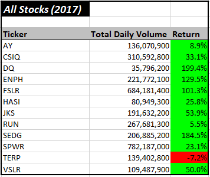
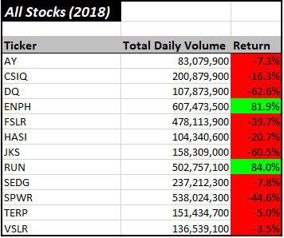
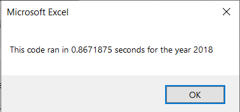
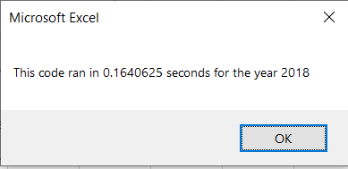

# Green-Energy Stocks Analysis
## Project Overview
### Background 
In this project, I am performing data analysis for green-energy stocks (from the year 2017 and 2018), in order to analyze their ***yearly return*** and ***total daily volume***.

For this data analysis I am using Microsoft ***Visual Basic for Applications*** or short ***VBA***, including **conditional statements**, **for loops**, **static and conditional formatting**, and nevertheless **code refactoring** in order to improve its efficiency and clarity.

A general idea using VBA is to automate tedious processes, improve the efficiency and uniformity of the analysis output, reduce the chances of accidents and errors and to write a code that can be used for similar future projects. The coding part in VBA (as well as in any other programming language) is not a one-time deal, yet is an ever-growing and ever-improving task. We can come back to the “old code”, and rewrite to make it work better. To highlight the importance of **refactoring** this analysis heavily focuses on this topic. In [VBA_Challenge.xlsm](VBA_Challenge.xlsm) file are two .vbs modules that contain VBA code **before refactoring (Module 1)** and **after refactoring (Module 2)**.

If you would like to try out the code, please download the [VBA_Challenge.xlsm](VBA_Challenge.xlsm) file (click on view raw) and enable all macros (enable editing and enable content).

### Purpose
The purpose of this analysis is to help Steve analyze the green-energy stock market for his parents. They are interested in investing in DAQO stocks (Ticker: DQ), a company that makes silicon wafers for solar panels. Before investing their money, Steve wants to run some analyses and check DQ stocks performance over the years in comparison to other green-energy stocks. Results will help him determine if DQ stocks are worth investing his parents’ money.

<p align="center">
In this report :recycle: symbol is used to highlight findings for Steve.
</p>

## Results
### Analysis of green stocks for 2017 and 2018

The table below displays the analysis for a dozen green-energy stocks (companies that use alternative energy rather than fossil fuels in the form of Hydroelectricity, Geothermal energy, Wind Energy, and Bio Energy). The table contains three groups of data:
- Ticker name.
- Total daily volume for a given year.
- Percentage of a yearly return. 

<p align="center">
    
</p>

#### Yearly return (%)

Green-energy stocks in 2017 had a high ratio of positive yearly returns (only one green-energy stock (TERP)) had a negative yearly return. Analysis from 2018 showed a completely different picture. The majority of stocks had negative returns. The drop was significant. The DQ stock had almost **200%** yearly return in **2017**, but in **2018** the stock dropped and finished the year with **negative 63%**. 

:recycle: These results indicate a risky investment. The stock trend is not stable and might not be worth investing all the money in DQ stocks.

#### Daily volume 

In general, a high volume of daily trading is an indicator of a stable stock, with a lot of interest and activity. It is true that in some cases low trading volume can be promising, especially where companies “that have yet to be discovered”(1). 

:recycle: DQ stocks in 2017 had low volume and high yearly return (at that time this might be an indicator of a company on a rise). However, the situation of DQ stocks in 2018 has changed completely. Stocks closed its year with negative 63%. Trading volume was higher, yet didn’t result in a positive outcome. The results of this analysis confirmed a risky investment in DQ stocks.

### The code behind the table 
Both scripts **“AllStockAnalysis”** and **“AllStockAnalysisRefactored”** have the same output. Codes run calculations from the following [dataset](VBA_Challenge.xlsm) and return data on a new worksheet **All_Stock_Analysis**. The idea of presenting two codes with the same output is to highlight the **importance of refactoring**.
     
#### Ticker (column A):
Array `Dim tickers(12) As String` holds 12 elements - tickers. Variable `tickerIndex` accesses array indexes and returning values in the table. 

####  Total Daily Volume (colum B):
The following code calculates **The Total Volume** for specific ticker: `tickerVolumes(tickerIndex) = tickerVolumes(tickerIndex) + Cells(i, 9).Value` To make this code work we need to create an array `Dim tickerVolumes(12) As Long` that holds 12 elements, and use our new variable `tickerIndex` to access ticker index in order to store the right value for the right ticker. Before and after the ticker changes the equation above sums up total daily volume.

####  Yearly Return (column C):

The following code calculates **Yearly Return**
```
If Cells(i - 1, 2).Value <> tickers(tickerIndex) And Cells(i, 2).Value = tickers(tickerIndex) Then 
    tickerStartingPrices(tickerIndex) = Cells(i, 7).Value
End If

If Cells(i + 1, 2).Value <> tickers(tickerIndex) And Cells(i, 2).Value = tickers(tickerIndex) Then
    tickerEndingPrices(tickerIndex) = Cells(i, 7).Value
End If
```
To make this code work we need to use conditionals or `if statements`. As before, the variable `tickerIndex` helps us find the starting and ending point of an old/new ticker in the dataset. Arrays `Dim tickerStartingPrices(12) As Single` and `Dim tickerEndingPrices(12) As Single` store captured values.
In “human” language we would read the following code something like this: 

>If the cell value in previous row (2nd column) is not the same as current cell value (2nd column), (that means the ticker index has reached a starting point of the new ticker), then capture the value for starting price of a new ticker in a current row (7th column) and store it in a “container” named tickerEndingPrices under label “current” tickerIndex. And similarly for ending prices.

#### For loops
For loops are responsible for executing the code in a repetitive manner until the condition is met. 
Incrementing a variable by 1  `tickerIndex = tickerIndex + 1` is  responsible to move to the next ticker.
By initializing arrays `tickerVolumes(tickerIndex) = 0` we reset the total volume to zero, before entering the loop again. 

#### Formatting 
In order to make the final table (output) organized and visually pleasing, the code also contain formatting syntax.
Here is an example of static formatting:

```
Range("A1").Font.Italic = True
Cells(1, 1).Font.Size = 14
Range("B4").NumberFormat = "#,##0"
```
All formating that is possible in Excel, we can execute in VBA as well. By selecting a cell `Cells(1, 1)` or a range `Range("A3:C3")` we define where we want to apply formatting. There are plenty of useful sites online like [this](https://www.excelhowto.com/macros/formatting-a-range-of-cells-in-excel-vba/) where we can find clear formatting instructions. 

Here is an example of conditional formatting.
```
 If Cells(i, 3) > 0 Then 'set a condition
    Cells(i, 3).Interior.Color = vbGreen 'color cell green
                 …
End If
```
By applying conditionals or `if statements` we can set conditions when and where formatting changes should be executed or not.

### Code comparison
Table below shows main diferences between code *before refactoring* and code *after refactoring* and their *run-time*. 

Code before refactoring (Module 1). |  Code after refactoring (Module 2).
:------------------------------------------:| :-------------------------------------:
Code with nested loops(click to enlarge).  | Code without nested loops creating multiple loops (click to enlarge).	
 | 
The code in a nested loop is switching back and forth between worksheets. | Code stays in the same loop, gathers all data and stores it in arrays. In a separate for loop the results are populated in the selected worksheet.  
 Execution time of the code: |  Execution time of the code:
 | 

<p align="center">
:heavy_check_mark: The refactored code runs 5x faster.
</p>

## Summary

### What are the advantages or disadvantages of refactoring code?

:leaves: The purpose and the ***advantages*** of refactoring code are to improve code:

- **efficiency** - code is taking fewer steps, therefore taking up less computer memory and taking-up less time to execute the code, 
- **readability** - code is easier to understand, it’s *cleaner* as a result of improved logic of the code, 
- **functionality** - fixing any bugs that might have been overlooked in the original code.

:leaves: On the other hand, ***the downsides*** of refactoring code (ours or someone else's) can be:

- **frustrating** and **time-consuming** - we might not be aware of the purpose of the code and its functionality. Especially when the code is not well commented and we could spend a lot of time figuring out what specific lines or blocks of code are supposed to do. That's why the good documentation and commenting the code is very important.
- **less efficient** - by refactoring the code, we could end up with a less efficient script. 

### How do these pros and cons apply to refactoring the original VBA script?

There is no doubt that this analysis was challenging. Although refactoring the code doesn’t require adding new functionality, but “rather improving the logic of the code to make it easier for future users to read” (2), it is not a simple task. 

- There are pros and cons to both sides. Refactoring VBA scripts, especially for beginners (like myself -- at this point), requires quite a bit of effort. At some point was a bit **frustrating** and **confusing**, since the understanding of the basics weren’t under the belt yet. Yet, on the other hand, was extremely **rewarding** and **fulfilling**. This technique added up another level of coding -- that is -- deepened the understanding of the logic of the code. Hard work was paid off with new knowledge and understanding of the complex structure of the code. Moreover, I was able to see improved efficiency immediately. 
By rewriting the script we were able to avoid nested loops, so the code wasn’t switching back and forth between the worksheets (that can be quite process-intensive). The new code ran much faster, **5-times faster** and because of this, we could reuse the new code on a much larger data set. Another bigger improvement of the code was accessing the arrays with a single variable `tickerIndex`. In this case, code stored all elements in arrays before switching to another worksheet. 

- At this point, we cannot and we shouldn’t forget about our *“old code”*. I was able to successfully finish the challenge because the *old code* was well commented (was easier to follow the logic of the code), was functioning, and had good foundations. The code executed the desired output in a decent amount of time. Yet, on the other hand, one of the advantages of coding is that we can reuse code for different purposes. The *old code* did well on smaller data set what would be much more challenging on the larger data set. 


## References
(1) “Is a Stock's Trade Volume Important?, https://www.investopedia.com/articles/investing/060315/stocks-trade-volume-important.asp#:~:text=If%20you%20see%20a%20stock,more%20demand%20for%20that%20stock.,Web 23 Jul 2020.)

(2) “Module 2: VBA of Wall Street.” https://courses.bootcampspot.com/courses/200/assignments/4444?module_item_id=57449, Trilogy Education Services, 2000. Web 23 Jul 2020.


## Additional useful articles
- [Arrays](https://docs.microsoft.com/en-us/office/vba/language/concepts/getting-started/using-arrays)
- [ColorIndex](http://dmcritchie.mvps.org/excel/colors.htm)
- [Variables](https://powerspreadsheets.com/declare-variables-vba-excel/)
- [Formatting](https://www.excelhowto.com/macros/formatting-a-range-of-cells-in-excel-vba/)
- [Error Handling](https://excelmacromastery.com/vba-error-handling/)
